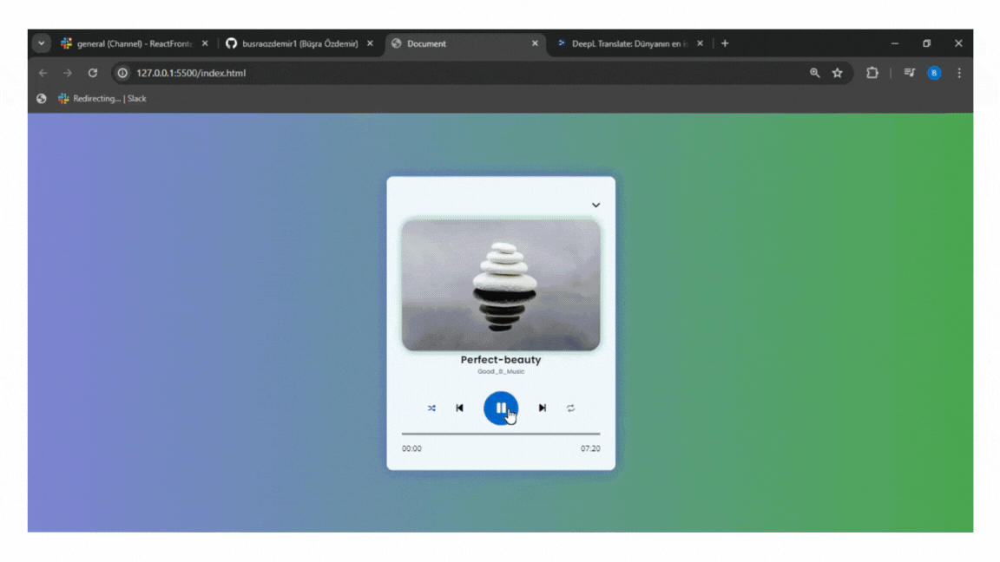

## PlayList

- Bu proje, HTML, CSS ve JavaScript kullanarak oluşturulmuş bir dijital Walkman uygulamasıdır. Kullanıcıların klasik Walkman deneyimini dijital ortamda yaşamasını sağlar. Uygulama, şarkı çalma, duraklatma, ileri/geri sarma gibi temel özellikleri destekler. 

### Özellikler 

- Şarkı Çalma/Duraklatma: Kullanıcılar şarkıları çalabilir ve duraklatabilir.

- İleri/Geri Sarma: Şarkılar arasında ileri ve geri sarma işlemleri yapılabilir.

- Şarkı Listesi: Oynatma listesi desteği.

- Temalar: Farklı temalar arasında geçiş yapabilme.

### Kullanım 

- Şarkı Seçimi: Oynatma listesinden bir şarkı seçin.

- Çalma/Duraklatma: Çalma/Duraklatma butonuna basarak şarkıyı başlatın veya durdurun.

- İleri/Geri Sarma: İleri ve geri sarma butonlarını kullanarak şarkıda gezinin.

### Teknolojiler 

- HTML5: Projenin yapısı için.

- CSS3: Tasarım ve stil için.

- JavaScript: Dinamik işlevsellik ve etkileşim için.

#### Gif

